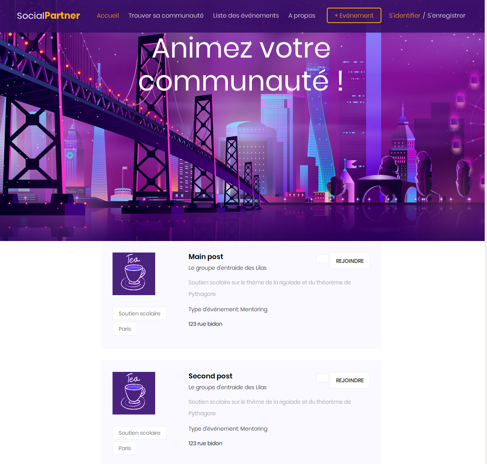

# Social Partner website

## Add a new html page

#### 1. Create a new file in app/views with the format `*.scala.html`
You can copy the format of `home.scala.html`

A scala.html file has the following format
```
@() <!-- function definition -->

<!-- html code -->

```

The adavantage of this format is the ability to add parameters to the html when the page is called. Example :

```
@(title: String) <!-- function definition -->

<h1> @title </h1>

```
This code will create a page with a title defined by the given parameter in input


#### 2. Reusing bricks
Another advantage of this format is the usage of a common format for all pages. The file `app/views/main.scala.html` demonstrates it.

```
@(title: String)(content: Html)
```

The parameters are the title of the webpage and the content of the inner page. Have a look at the screenshot of the following page which uses this simple code.

```
@()
@main("Dummy"){
  <h1> Ok </h1>
}
```


The main script handles the header, menu and footer. You just have to code your content inside the page


#### 3. Decomposing into small blocks
Another important element of for building an easy to maintain website to use small block of code. Let's see an example

```html
@()

@main("listing"){
<!-- Start post Area -->
<section class="post-area section-gap">
    <div class="container">
        <div class="row justify-content-center d-flex">
            <div class="col-lg-8 post-list">
                @single_post("Main post")
                @single_post("Second post")
            </div>
        </div>
    </div>
</section>
}
```

This screenshot demonstrates the two blocks we have seen in the code, with the title changed and the other default parameters unchanged.
The code of the list item can be found after.





```html
<!-- Code of single_post.scala.html -->
@(title: String = "Séance d'entraide scolaire", description: String = "Soutien scolaire sur le thème de la rigolade et du théorème de Pythagore", group: String = "Le groupe d'entraide des Lilas", tags: Seq[String] = Seq("Soutien scolaire", "Paris"), event_type: String = "Mentoring")

<div class="single-post d-flex flex-row">
    <div class="thumb">
        
        <ul class="tags">
            @for(tag <- tags){
            <li>
                <a href="#">@tag</a>
            </li>
            }
        </ul>
    </div>
    <div class="details">
        <div class="title d-flex flex-row justify-content-between">
            <div class="titles">
                <a href="single.html"><h4>@title</h4></a>
                <h6>@group</h6>
            </div>
            <ul class="btns">
                <li><a href="#"><span class="lnr lnr-heart"></span></a></li>
                <li><a href="#">Rejoindre</a></li>
            </ul>
        </div>
        <p>
            @description
        </p>
        <h5>Type d'événement: @event_type</h5>
        <p class="address"><span class="lnr lnr-map"></span> 123 rue bidon</p>
    </div>
</div>
}
```
This code will display a list of posts in the main frame.
Separating the html code of the post in a different file (function) allows to have reusable blocks (same block with a different title).